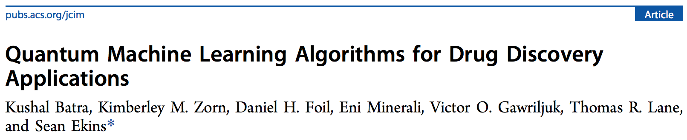
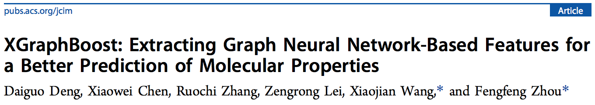
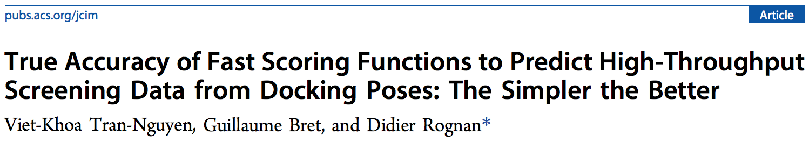
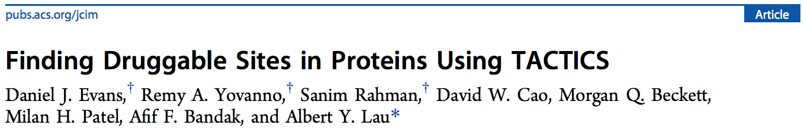

Hello! Recently, there was [a new JCIM release](https://pubs.acs.org/toc/jcisd8/current) (volume 61, issue 6). I like this journal a lot, and, as always, there are some articles that interested me the most. In this short post, I'd like to share the short summaries of these articles with you, and invite you to read/discuss them. My list doesn't have any particular order for the articles.

The cover of the most recent JCIM release

#### Article 1: [Quantum Machine Learning Algorithms for Drug Discovery Applications](https://pubs.acs.org/doi/10.1021/acs.jcim.1c00166) (Batra et al.)

Nowadays, there are more and more data on small molecules tested against various biological targets. This data is often used to train predictive machine learning (ML) models. 

The data is becoming so large, though, that it becomes challenging to use it to efficiently train conventional ML algorithms on classical computers (CC). For example, training conventional algorithms on large databases may take a considerable amount of time.

Quantum computers, on the other hand, could avoid this pitfall and produce equally good results using the same amount of high-dimensional data in a much shorter time – and this is exactly what the authors of this work show. 

Additionally, the authors turn the attention of readers to quantum computing as a new method that could potentially be used in drug discovery.

--- 

#### Article 2: [XGraphBoost: Extracting Graph Neural Network-Based Features for a Better Prediction of Molecular Properties](https://pubs.acs.org/doi/10.1021/acs.jcim.0c01489) (Deng et al.)

When working with molecular data, it is only natural to think of chemical compounds as graphs, with atoms being the vertices, and chemical bonds between them – the edges. 

The idea behind a current hot-topic in chemoinformatics is to use special trainable graph neural networks to learn the atomic features from the data in an end-to-end fashion, meaning that the features are learned by optimizing the predicted target values.

The authors of this work, however, show that graph neural networks' performance could be improved by extracting the features learned by a GNN and using them as input to a gradient boosting algorithm implemented in the `XGBoost` python library.

According to the benchmarking that the authors provide, such an approach significantly increases the predictive performance of models trained this way.

---

#### Article 3: [True Accuracy of Fast Scoring Functions to Predict High-Throughput Screening Data from Docking Poses: The Simpler the Better](https://pubs.acs.org/doi/10.1021/acs.jcim.1c00292) (Tran-Nguyen et al.)

In a typical virtual screening setting, a set of molecules is docked (using protein-ligand docking techniques) into a target protein of interest. It is then the task of the special docking score functions to "predict binding free energies from three-dimensional structures of protein-ligand
complexes". 

The authors of the present work (our colleagues from the University of Strasbourg, by the way!) wondered whether or not the four most popular fast scoring functions (2 machine learning-based, 2 knowledge-base topological functions) are capable of correctly picking the active molecules from the whole set of studied compounds, and which scoring functions perform the best.

To do so, they collected a database of "experimental
high-confidence screening data covering about 3 million data points on 15 diverse pharmaceutical targets". Then they performed the virtual screening of this library using 1 docking method and 4 scoring functions to computationally assess the "activity" of the docked compounds.

The result? Turns out, machine learning-based scoring functions perform worse than knowledge-base ones! Apparently, the ML ones are biased towards the values they were trained on.

---

#### Article 4: [Finding Druggable Sites in Proteins Using TACTICS](https://pubs.acs.org/doi/10.1021/acs.jcim.1c00204) (Evans et al.)

When trying to find a new drug against some protein, you may already know some of the available binding sites due to the presence of experimental crystal structures. 

However, it may be interesting to explore other, not-yet-established binding sites. This is especially true when dealing with so-called <i>cryptic</i> sites: the ones that "are apparent when a ligand is bound to it but difficult to detect when no ligand is present".

The authors of this paper present their own development, a utility called TACTICS, that inputs the results of an MD simulation of your protein, and, using machine learning algorithms, detects whether or not your macromolecule has these cryptic sites.

According to the authors, their algorithm is capable of detecting both known and unknown cryptic sites on known targets.

Additionally, what I liked about this paper is that it provides a very nice literature review on the topic of protein binding site detection.

---

Well, I guess that's it for today. Despite I only selected a few, the recent JCIM issue has many more fantastic articles, and I suggest you take a look at them [here](https://pubs.acs.org/toc/jcisd8/61/6). Thank you very much for your kind attention, I hope you enjoyed this short overview. See you next time! Cheers.